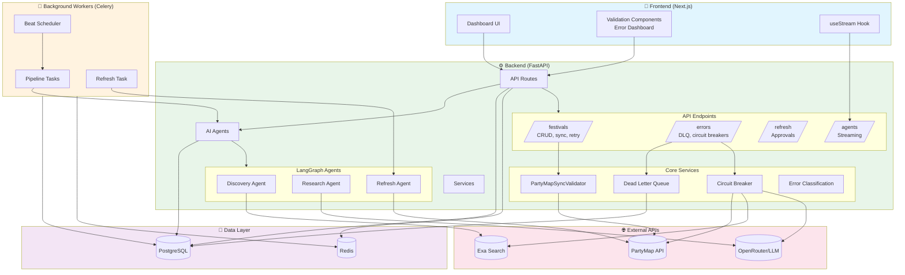

# PartyMap Festival Bot - Monorepo

An AI-powered festival discovery and management system that automatically finds, researches, and syncs music festival data to PartyMap.

## What is PartyMap Festival Bot?

PartyMap Festival Bot is an automated pipeline that discovers music festivals from across the web, enriches them with AI-powered research, and keeps them synchronized with the PartyMap platform. It's designed to solve the problem of stale or incomplete festival listings by continuously monitoring for new events and updates to existing ones.

### Core Capabilities

**1. Automated Discovery**

- **Exa AI Search**: Finds festival announcements across the web using neural search
- **Goabase Integration**: Syncs with Goabase (the world's largest psychedelic/underground party database) to discover transformational gatherings, psytrance festivals, and burner events
- **Duplicate Detection**: Prevents creating multiple entries for the same festival using fuzzy name matching and location comparison

**2. AI-Powered Research**

- Uses LangGraph agents to browse festival websites
- Extracts key information: dates, lineup, tickets, location
- Enriches data with descriptions, tags, and media
- Validates data quality before syncing

**3. Smart Sync to PartyMap**

- Creates new events with full details
- Updates existing events with fresh information
- Handles complex workflows (new event vs new date for existing event)
- Pre-flight validation ensures data meets PartyMap schema requirements

**4. Error Resilience & Recovery**

- Circuit breakers prevent cascading failures when external APIs are down
- Dead Letter Queue quarantines failed festivals for manual review
- Automatic retry with exponential backoff for transient errors
- Error classification (transient/permanent/validation/external/budget)

**5. Refresh Pipeline**

- Monitors unconfirmed event dates (120 days ahead)
- Re-researches festivals to verify/correct information
- Queues changes for human approval before applying
- Auto-cancels events that remain unconfirmed 30 days before start

**6. Human-in-the-Loop**

- Dashboard for monitoring all festivals and their status
- Manual approval workflow for high-stakes changes
- Bulk operations for efficiency
- Real-time streaming of AI agent progress

### Why This Exists

Music festivals are announced across hundreds of websites, social media platforms, and forums. Festival websites also often really suck (think dates and lineups embeded only in images on the page). Keeping a comprehensive, up-to-date directory has been the main challenge I've faced since I launched PartyMap. I just don't have the time or money for that. This bot automates 90%+ of the work while ensuring human oversight for quality control.

### Who Uses This

- **PartyMap admins**: Making sure everything running smoothly, managing the schedule, and manually approving events that the bot has found.
- **Event organizers**: Checkout bot.partymap.com to see how the bot found and processed your event
- **Festival-goers**: Users can suggest festivals or events for the bot to add to PartyMap

## Structure

```
partymap-bot/
├── apps/
│   ├── api/           # Python FastAPI backend
│   └── web/           # Next.js frontend
├── docker-compose.yml      # Production Docker orchestration
├── docker-compose.dev.yml  # Development overrides (hot reload)
└── package.json       # Root workspace config
```

## Architecture



### Data Flow

1. **Discovery**: Exa search → AI analysis → Festival creation → Deduplication
2. **Research**: LLM enrichment → Validation → PartyMap sync
3. **Refresh**: Unconfirmed dates → Research → Human approval → Update
4. **Error Handling**: Retry → Circuit breaker → Quarantine → Manual retry

### Key Features

| Feature                  | Implementation                                                            |
| ------------------------ | ------------------------------------------------------------------------- |
| **Validation**           | Pre-flight checks before PartyMap sync with completeness scoring          |
| **Circuit Breakers**     | 5 failures/60s threshold, 30s recovery timeout for external APIs          |
| **Dead Letter Queue**    | 30-day retention for failed festivals, manual retry only                  |
| **Streaming**            | SSE format compatible with LangGraph's `useStream()` hook                 |
| **Error Classification** | Automatic categorization (transient/permanent/validation/external/budget) |

## Quick Start with Docker

### Prerequisites

- Docker and Docker Compose

### 1. Create environment file

```bash
cp .env.example .env
# Edit .env and add your API keys:
# OPENROUTER_API_KEY=your_key_here
# EXA_API_KEY=your_key_here
```

### 2. Start all services (Development)

```bash
# Build
docker compose -f docker-compose.yml -f docker-compose.dev.yml build

# Start with hot reload for development
docker compose -f docker-compose.yml -f docker-compose.dev.yml up -d

# Or start and view logs directly
docker compose -f docker-compose.yml -f docker-compose.dev.yml up
```

### 3. Verify services are running

```bash
# Check container status
docker compose -f docker-compose.yml -f docker-compose.dev.yml ps

# View API logs
docker compose -f docker-compose.yml -f docker-compose.dev.yml logs -f api

# View web logs
docker compose -f docker-compose.yml -f docker-compose.dev.yml logs -f web
```

### 4. Access the services

| Service   | URL                         | Description                |
| --------- | --------------------------- | -------------------------- |
| Web UI    | http://localhost:3000       | Next.js frontend dashboard |
| API Docs  | http://localhost:8000/docs  | FastAPI Swagger UI         |
| API Redoc | http://localhost:8000/redoc | FastAPI ReDoc              |
| Database  | localhost:5438              | PostgreSQL (direct access) |
| Redis     | localhost:6379              | Redis (direct access)      |

### 5. Stop services

```bash
# Stop all services
docker compose -f docker-compose.yml -f docker-compose.dev.yml down

# Stop and remove volumes (clears database data)
docker compose -f docker-compose.yml -f docker-compose.dev.yml down -v
```

## Common Docker Commands

### Running Migrations

Migrations run automatically when containers start. To run manually:

```bash
# Run pending migrations
docker compose -f docker-compose.yml -f docker-compose.dev.yml exec api alembic upgrade head

# Check current migration version
docker compose -f docker-compose.yml -f docker-compose.dev.yml exec api alembic current

# Rollback one migration
docker compose -f docker-compose.yml -f docker-compose.dev.yml exec api alembic downgrade -1

# Create new migration (with autogenerate)
docker compose -f docker-compose.yml -f docker-compose.dev.yml exec api alembic revision --autogenerate -m "description"
```

### Rebuilding Containers

```bash
# Rebuild all containers
docker compose -f docker-compose.yml -f docker-compose.dev.yml build

# Rebuild specific service
docker compose -f docker-compose.yml -f docker-compose.dev.yml build api

# Rebuild and restart
docker compose -f docker-compose.yml -f docker-compose.dev.yml up -d --build
```

### Executing Commands in Containers

```bash
# Open Python shell in API container
docker compose -f docker-compose.yml -f docker-compose.dev.yml exec api python

# Open database shell
docker compose -f docker-compose.yml -f docker-compose.dev.yml exec db psql -U partymap -d partymap_bot

# Install new Python dependency
docker compose -f docker-compose.yml -f docker-compose.dev.yml exec api pip install <package>

# Run API tests
docker compose -f docker-compose.yml -f docker-compose.dev.yml exec api pytest
```

### Restarting Services

```bash
# Restart all services
docker compose -f docker-compose.yml -f docker-compose.dev.yml restart

# Restart specific service
docker compose -f docker-compose.yml -f docker-compose.dev.yml restart api
```

## Services

| Service   | Port | Description                |
| --------- | ---- | -------------------------- |
| web       | 3000 | Next.js frontend dashboard |
| api       | 8000 | FastAPI backend            |
| worker    | -    | Celery task worker         |
| scheduler | -    | Celery Beat scheduler      |
| db        | 5438 | PostgreSQL database        |
| redis     | 6379 | Redis cache/queue          |

## Development

### Frontend (Next.js)

```bash
cd apps/web
npm install
npm run dev
```

### Backend (Python)

```bash
cd apps/api
pip install -e "."
uvicorn src.main:app --reload
```

## Environment Variables

Create a `.env` file in the root directory:

```bash
OPENROUTER_API_KEY=your_key_here
EXA_API_KEY=your_key_here
PARTYMAP_API_KEY=your_key_here
```

## API Documentation

When running locally, API documentation is available at:

- Swagger UI: http://localhost:8000/docs
- ReDoc: http://localhost:8000/redoc
